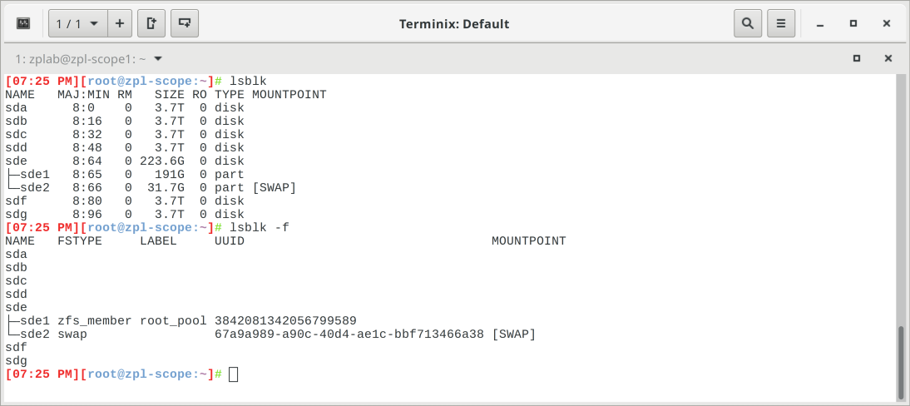

# md Array Protocols

## Notes

### md and XFS: Fast and Resilient, Best Effort, No Guarantees 

[md](http://linux.die.net/man/4/md) is the traditional Linux software RAID subsystem. We use it because, in addition to being very well tested and 
flexible, the particular trade-offs selected by the md authors closely match lab needs, offering excellent read and write performance with disk 
fault tolerance and _acceptable_ assurance of data integrity. Likewise, [XFS](http://oss.sgi.com/projects/xfs/) follows the same tradition, and is 
the filesystem we use on md arrays. Unlike new generation, copy-on-write integrated filesystem / device aggregation layers such as BTRFS and ZFS, 
neither md nor XFS _positively_ ensure data integrity, instead relying on data written to disk being the same as data read from disk.
 
### Going Beyond Best-effort Data Integrity: par2
 
If such assurance is required, for example because a single bit change in experimental data would drastically alter results of analysis, use the 
[par2](http://www.the-tech-tutorial.com/parchive-quick-tutoiral/) command or a compatible application or front-end to generate parity sets of 
desired robustness.

### mdadm and mkfs.xfs

The mdadm utility is required for array manipulation. If it is not installed, run 'apt-get install mdadm' as root or with sudo. For array 
filesystem creation, mkfs.xfs is also required, but it is part of the default Kubuntu installation and should be available.

## Disk initialization

Although an unpartitioned disk may be a member of an md array, it is advisable to make a GPT partition table containing a single partition filling 
the disk. This avoids silent corruption in the common case of intentional or unintentional installation of a boot sector to an md array member 
disk. The parted utility is required for this task; if it is not installed, run `apt-get install parted` as root or with sudo. If you do not know 
the device name of the disk(s) you wish to initialize, run the `lsblk` and `lsblk -f` commands:

