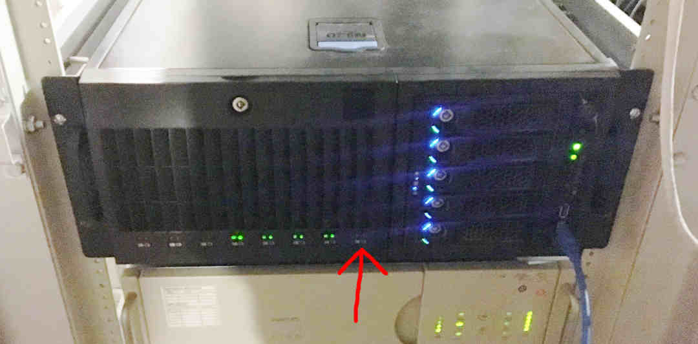

# Identifying a Physical Drive

Various ZPLAB production Linux system maintenance tasks require distinguishing a hard drive or SSD of interest within a collection of drives that 
appear nearly identical. 
 
### By drive activity LED

Failed raid member disk replacement is the most common task requiring identification of a physical drive. Some ZPLAB production Linux systems have 
per-drive activity indicator LEDs. On such systems, you need only induce sustained array activity and examine the drive activity indicators to 
indentify the inactive drive. This can be done with the ```dd``` command, replacing "chunk" with the name of the array in question (eg, 
"scopearray"):

```
$ sudo dd if=/dev/md/chunk of=/dev/null bs=4096
▓
```

With this command running, let's examine our indicators:



The red arrow points to a drive that would be active, had it not failed.

### By serial number