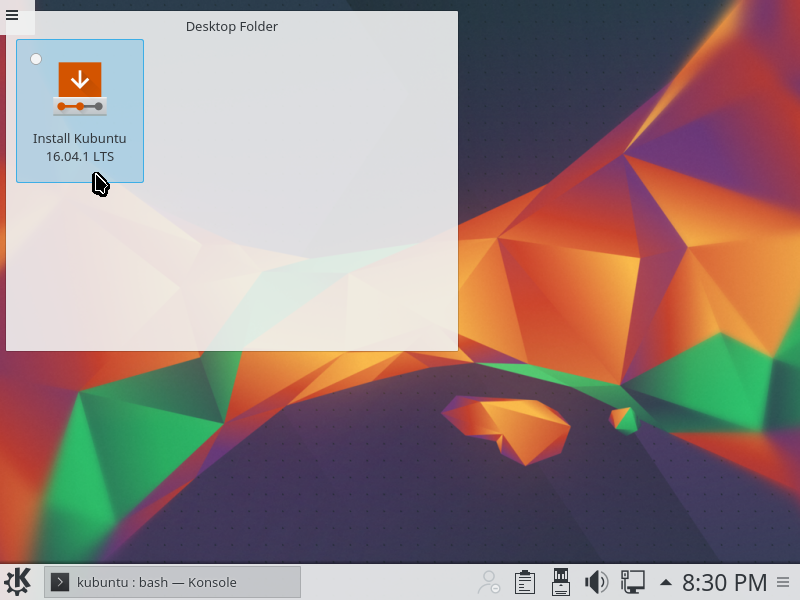

# ZPLAB Production Linux System Installation and Configuration

"ZPLAB production Linux system" refers to any computer in the lab that controls hardware for running scientific experiments and/or is
available to lab users on a shared basis for experiment data storage and analysis. These systems run the latest Kubuntu LTS release and
should be installed and configured as specified in this document.

### Kubuntu vs Ubuntu

Kubuntu is an officially supported variant of Ubuntu, differing only in that KDE rather than Unity is installed by default. The difference
is relatively unimportant, and these instructions should apply just as well to Ubuntu as to Kubuntu.

### A note on installing to a system with an existing RAID array

If the array or arrays were created following the instructions in the [array protocols and procedures document](./array_protocols_and_procedures.md),
no additional steps are required in order to protect the array from damage during Linux installation or reinstallation. The disk to be
used as root should be readily identifiable in the output of the `lsblk` command. If care is taken to partition and format only this
disk, the installation process will have no impact on the array. A configuration step is required to make the array properly visible
to users of the newly installed system; this step is detailed in the _Configuring a pre-existing array_ subsection of the _Configuration_
section.

## Preparation

### Find or make a bootable Kubuntu USB flash memory stick

If there is not already a USB flash memory stick available with the latest Kubuntu LTS release,
[download the 64-bit release](http://www.kubuntu.org/getkubuntu/). Once the download completes, follow the instructions for creating a
bootable USB stick on the operating system where you downloaded Kubuntu:
[OS X / macOS](http://www.ubuntu.com/download/desktop/create-a-usb-stick-on-mac-osx),
[Linux](http://askubuntu.com/questions/372607/how-to-create-a-bootable-ubuntu-usb-flash-drive-from-terminal),
[Windows](http://www.ubuntu.com/download/desktop/create-a-usb-stick-on-windows).

### Boot the Kubuntu USB flash memory stick

On a non-Apple computer, just having the USB stick connected when the system is powered-on or rebooted
often works, but it may be necessary to modify BIOS settings in order to place "USB thumb drives" or "USB hard disks" first in the boot order. On an
Apple computer, it may be necessary to hold down the "C" key as the system is powered-on or rebooted in order to be presented with a menu allowing
boot device selection.

### Open a terminal window

Once the system boots into a graphical interface and settles down, click the launcher button in the lower left corner of the screen,
type "konsole", and press enter.


### Verify that a network connection is available

A network connection is required for the next step and for following steps. At ZPLAB, getting a
network connection typically only requires plugging in a network cable connected to a working bench or wall port. Not all bench and wall ports work.
In particular, open ports in obscure locations tend not to be "provisioned", a state that can mean many different things, but one that is always
resolved by sending and email to Kyle.

Connectivity can be verified by running `ping www.google.com` in the terminal window opened in the previous step.

### ZFS?

Configuring the installation to use a ZFS root recommended for multi-user production Linux systems. ZFS provides good options for rapidly
escaping bad situations, and it has saved our bacon a number of times. However, a special-purpose system that is fast to configure and rarely
changed wouldn't necessarily benefit from ZFS, and any system with less than 16GiB of RAM is unlikely to receive any benefit unless a specific need
exists.

* Example of a system that **should have a ZFS root**: a custom-built computer controlling a Leica microscope situated in an incubator, hosting
a number of experiments belonging to any number of lab members.

* Example of a system that **may optionally have a ZFS root**: a fully-upgraded Mac Mini that has 16GiB of RAM, run Kubuntu, is connected to 6
scanners, and is primarily used by one lab member. OS X / macos would be a good choice for this role, except that SANE tends to be better behaved
on Linux and large numbers of USB devices are known to be problematic on certain OS X / macos releases.

* Example of a system that **should not have a ZFS root without a specific reason**: a Mac Mini running Linux, used by a single user for analyzing
data, examining images, reading and composing papers, email, presentations, and for other day-to-day tasks. Feel free to use whatever operating
system and configuration is most efficient for you on your assigned desktop system. This may be OS X / macos, Kubuntu, Windows, or some other Linux
flavor. However, any time spent using a ZFS root will probably be wasted unless you know you need it for some specific reason, such as manipulating
snapshots of million-file source trees as you track down a bug in Chromium (snapshot copy-on-write is a big time saver in this scenario - but this
scenario is uncommon at ZPLAB).

### If you don't need ZFS

___Skip this section if you need a ZFS root volume!___

If you don't need a ZFS root, using the GUI installer will save you some time. Minimize the Konsole window you opened previous and click the GUI
installer icon on the desktop.



The default installer options are fine. Even the correct timezone should be detected. When prompted, create a user with the name and user name
`zplab` and the password `wustlzplab`. Once the installation completes and the system has booted into the new installation, resume following the
intructions in this document at start of the _Configuration_ section.

### Install ZFS Utilities in the Live Environment

Although ZFS is officially supported by Ubuntu and is included in the official Ubuntu package
repository, the environment you get when you boot the Ubuntu/Kubuntu installation media does not have the ZFS utilities installed. Forunately,
installing ZFS in the live environment is no more difficult than installing any package on a fully configured Ubuntu system.

In the Konsole window you opened previously, type `sudo -s` and press enter. Next, type `apt-get update` and press enter. You should see something
like the following:

```
kubuntu@kubuntu:~$ sudo -s
root@kubuntu:~# apt-get update
Ign:1 cdrom://Kubuntu 16.04.1 LTS _Xenial Xerus_ - Release amd64 (20160719) xenial InRelease
Hit:2 cdrom://Kubuntu 16.04.1 LTS _Xenial Xerus_ - Release amd64 (20160719) xenial Release
Get:3 http://security.ubuntu.com/ubuntu xenial-security InRelease [94.5 kB]
Hit:5 http://archive.ubuntu.com/ubuntu xenial InRelease
Get:6 http://security.ubuntu.com/ubuntu xenial-security/main amd64 Packages [138 kB]
Get:7 http://archive.ubuntu.com/ubuntu xenial-updates InRelease [95.7 kB]
Get:8 http://security.ubuntu.com/ubuntu xenial-security/main Translation-en [56.6 kB]
Get:9 http://security.ubuntu.com/ubuntu xenial-security/main amd64 DEP-11 Metadata [66.8 kB]
Get:10 http://security.ubuntu.com/ubuntu xenial-security/main DEP-11 64x64 Icons [58.1 kB]
Get:11 http://security.ubuntu.com/ubuntu xenial-security/universe amd64 Packages [41.1 kB]
Get:12 http://security.ubuntu.com/ubuntu xenial-security/universe Translation-en [24.9 kB]
Get:13 http://security.ubuntu.com/ubuntu xenial-security/universe amd64 DEP-11 Metadata [2,328 B]
Get:14 http://archive.ubuntu.com/ubuntu xenial-updates/main amd64 Packages [383 kB]
Get:15 http://archive.ubuntu.com/ubuntu xenial-updates/main Translation-en [146 kB]
Get:16 http://archive.ubuntu.com/ubuntu xenial-updates/main amd64 DEP-11 Metadata [299 kB]
Get:17 http://archive.ubuntu.com/ubuntu xenial-updates/main DEP-11 64x64 Icons [188 kB]
Get:18 http://archive.ubuntu.com/ubuntu xenial-updates/universe amd64 Packages [324 kB]
Get:19 http://archive.ubuntu.com/ubuntu xenial-updates/universe Translation-en [111 kB]
Get:20 http://archive.ubuntu.com/ubuntu xenial-updates/universe amd64 DEP-11 Metadata [102 kB]
Get:21 http://archive.ubuntu.com/ubuntu xenial-updates/universe DEP-11 64x64 Icons [93.1 kB]
Fetched 2,224 kB in 1s (1,710 kB/s)

** (appstreamcli:4595): CRITICAL **: Error while moving old database out of the way.
AppStream cache update failed.
Reading package lists... Done
root@kubuntu:~# apt-cache search zfs
parted - disk partition manipulator
bzflag-server - 3D first person tank battle game -- server
collectd-core - statistics collection and monitoring daemon (core system)
golang-go-zfs-dev - Go library for ZFS manipulation
libguestfs-zfs - guest disk image management system - ZFS support
libuutil1linux - Solaris userland utility library for Linux
libuutil1linux-dbg - Debugging symbols for libuutil1linux
libzfs2linux - Native OpenZFS filesystem library for Linux
libzfs2linux-dbg - Debugging symbols for libzfs2
libzfslinux-dev - Native OpenZFS filesystem development files for Linux
libzpool2linux - Native OpenZFS pool library for Linux
simplesnap - Simple and powerful network transmission of ZFS snapshots
zfs-dkms - Native OpenZFS filesystem kernel modules for Linux
zfs-doc - Native OpenZFS filesystem documentation and examples.
zfs-fuse - ZFS on FUSE
zfs-initramfs - Native OpenZFS root filesystem capabilities for Linux
zfs-zed - OpenZFS Event Daemon (zed)
zfs-zed-dbg - Debugging symbols for zfs-zed
zfsnap - Automatic snapshot creation and removal for ZFS
zfsutils-linux - Native OpenZFS management utilities for Linux
zfsutils-linux-dbg - Debugging symbols for zfsutils-linux
root@kubuntu:~#
```

The `** (appstreamcli:4595): CRITICAL **: Error while moving old database out of the way.` error is expected and should be
ignored. (apt failed to move the old database because there was no old database. That's fine.)

Next, type `apt-get install zfsutils-linux` and press enter. You should see something like the following:

```
apt-get install zfsutils-linux
Reading package lists... Done
Building dependency tree
Reading state information... Done
The following additional packages will be installed:
  libnvpair1linux libuutil1linux libzfs2linux libzpool2linux zfs-doc zfs-zed
Suggested packages:
  default-mta | mail-transport-agent nfs-kernel-server zfs-initramfs
The following NEW packages will be installed:
  libnvpair1linux libuutil1linux libzfs2linux libzpool2linux zfs-doc zfs-zed zfsutils-linux
0 upgraded, 7 newly installed, 0 to remove and 98 not upgraded.
Need to get 896 kB of archives.
After this operation, 2,897 kB of additional disk space will be used.
Do you want to continue? [Y/n]
Get:1 http://archive.ubuntu.com/ubuntu xenial-updates/main amd64 zfs-doc all 0.6.5.6-0ubuntu12 [49.5 kB]
Get:2 http://archive.ubuntu.com/ubuntu xenial-updates/main amd64 libuutil1linux amd64 0.6.5.6-0ubuntu12 [27.5 kB]
Get:3 http://archive.ubuntu.com/ubuntu xenial-updates/main amd64 libnvpair1linux amd64 0.6.5.6-0ubuntu12 [23.5 kB]
Get:4 http://archive.ubuntu.com/ubuntu xenial-updates/main amd64 libzpool2linux amd64 0.6.5.6-0ubuntu12 [385 kB]
Get:5 http://archive.ubuntu.com/ubuntu xenial-updates/main amd64 libzfs2linux amd64 0.6.5.6-0ubuntu12 [106 kB]
Get:6 http://archive.ubuntu.com/ubuntu xenial-updates/main amd64 zfsutils-linux amd64 0.6.5.6-0ubuntu12 [276 kB]
Get:7 http://archive.ubuntu.com/ubuntu xenial-updates/main amd64 zfs-zed amd64 0.6.5.6-0ubuntu12 [29.8 kB]
Fetched 896 kB in 0s (1,134 kB/s)
Selecting previously unselected package zfs-doc.
(Reading database ... 161341 files and directories currently installed.)
Preparing to unpack .../zfs-doc_0.6.5.6-0ubuntu12_all.deb ...
Unpacking zfs-doc (0.6.5.6-0ubuntu12) ...
Selecting previously unselected package libuutil1linux.
Preparing to unpack .../libuutil1linux_0.6.5.6-0ubuntu12_amd64.deb ...
Unpacking libuutil1linux (0.6.5.6-0ubuntu12) ...
Selecting previously unselected package libnvpair1linux.
Preparing to unpack .../libnvpair1linux_0.6.5.6-0ubuntu12_amd64.deb ...
Unpacking libnvpair1linux (0.6.5.6-0ubuntu12) ...
Selecting previously unselected package libzpool2linux.
Preparing to unpack .../libzpool2linux_0.6.5.6-0ubuntu12_amd64.deb ...
Unpacking libzpool2linux (0.6.5.6-0ubuntu12) ...
Selecting previously unselected package libzfs2linux.
Preparing to unpack .../libzfs2linux_0.6.5.6-0ubuntu12_amd64.deb ...
Unpacking libzfs2linux (0.6.5.6-0ubuntu12) ...
Selecting previously unselected package zfsutils-linux.
Preparing to unpack .../zfsutils-linux_0.6.5.6-0ubuntu12_amd64.deb ...
Unpacking zfsutils-linux (0.6.5.6-0ubuntu12) ...
Selecting previously unselected package zfs-zed.
Preparing to unpack .../zfs-zed_0.6.5.6-0ubuntu12_amd64.deb ...
Unpacking zfs-zed (0.6.5.6-0ubuntu12) ...
Processing triggers for libc-bin (2.23-0ubuntu3) ...
Processing triggers for initramfs-tools (0.122ubuntu8.1) ...
update-initramfs is disabled since running on read-only media
Processing triggers for systemd (229-4ubuntu7) ...
Processing triggers for ureadahead (0.100.0-19) ...
Processing triggers for man-db (2.7.5-1) ...
Setting up zfs-doc (0.6.5.6-0ubuntu12) ...
Setting up libuutil1linux (0.6.5.6-0ubuntu12) ...
Setting up libnvpair1linux (0.6.5.6-0ubuntu12) ...
Setting up libzpool2linux (0.6.5.6-0ubuntu12) ...
Setting up libzfs2linux (0.6.5.6-0ubuntu12) ...
Setting up zfsutils-linux (0.6.5.6-0ubuntu12) ...
zfs-import-cache.service is a disabled or a static unit, not starting it.
zfs-import-scan.service is a disabled or a static unit, not starting it.
zfs-mount.service is a disabled or a static unit, not starting it.
Processing triggers for initramfs-tools (0.122ubuntu8.1) ...
update-initramfs is disabled since running on read-only media
Setting up zfs-zed (0.6.5.6-0ubuntu12) ...
zed.service is a disabled or a static unit, not starting it.
Processing triggers for libc-bin (2.23-0ubuntu3) ...
Processing triggers for systemd (229-4ubuntu7) ...
Processing triggers for ureadahead (0.100.0-19) ...
root@kubuntu:~#
```

### Install debootstrap

This is the core installation utility; we will invoke it in the _Installation_ section, after creating our root ZFS volume. In the Konsole window
you opened earlier, run `apt-get install debootstrap`. You should see something like the following:

```
root@kubuntu:~# apt-get install debootstrap
Reading package lists... Done
Building dependency tree
Reading state information... Done
The following NEW packages will be installed:
  debootstrap
0 upgraded, 1 newly installed, 0 to remove and 100 not upgraded.
Need to get 35.7 kB of archives.
After this operation, 256 kB of additional disk space will be used.
Get:1 http://archive.ubuntu.com/ubuntu xenial-updates/main amd64 debootstrap all 1.0.78+nmu1ubuntu1.1 [35.7 kB]
Fetched 35.7 kB in 0s (117 kB/s)
Selecting previously unselected package debootstrap.
(Reading database ... 164244 files and directories currently installed.)
Preparing to unpack .../debootstrap_1.0.78+nmu1ubuntu1.1_all.deb ...
Unpacking debootstrap (1.0.78+nmu1ubuntu1.1) ...
Processing triggers for man-db (2.7.5-1) ...
Setting up debootstrap (1.0.78+nmu1ubuntu1.1) ...
```

### Optional: install sshd in the live environment and "ssh in" from somewhere nicer

This is particularly advantageous if the live environment comes up in a low resolution graphical mode or in 80x24 text mode. In the Konsole window
you opened earlier,

* run `apt-get install openssh-server`
* set a simple root password such as the letter _a_ by running the `passwd` command
* either
  * use `nano -w /etc/ssh/sshd_config` to modify the line `PermitRootLogin prohibit-password` so that it reads `PermitRootPassword yes`
  * or run the command `sed -i 's/PermitRootLogin prohibit-password/PermitRootPassword yes/' /etc/ssh/sshd_config`
* run `systemctl restart sshd`
* run `ip addr` and find the network adapter's IP address in the output (it will probably start with `10.` and be followed by `/24`)

On another machine, run `ssh root@10.xxx.xxx.xxx`, replacing the `x` values with the IP address found with `ip addr`.

## Installation

Keep that Konsole window open or SSH connection connected! We're not done running commands quite yet...

### Use `lsblk` to identify the drive to be used as root

```
root@kubuntu:~# lsblk
NAME   MAJ:MIN RM   SIZE RO TYPE MOUNTPOINT
sda      8:0    0   3.7T  0 disk
└─sda1   8:1    0   3.7T  0 part
sdb      8:16   0   3.7T  0 disk
└─sdb1   8:17   0   3.7T  0 part
sdc      8:32   0   3.7T  0 disk
└─sdc1   8:33   0   3.7T  0 part
sdd      8:48   0 238.5G  0 disk
├─sdd1   8:49   0 205.9G  0 part
└─sdd2   8:50   0  31.7G  0 part [SWAP]
sde      8:64   0   3.7T  0 disk
└─sde1   8:65   0   3.7T  0 part
sdf      8:80   0   3.7T  0 disk
└─sdf1   8:81   0   3.7T  0 part
sdg      8:96   0   3.7T  0 disk
└─sdg1   8:97   0   3.7T  0 part
sdh      8:112  0   3.7T  0 disk
└─sdh1   8:113  0   3.7T  0 part
sdi      8:128  0   3.7T  0 disk
└─sdi1   8:129  0   3.7T  0 part
sdj      8:144  0  14.6G  0 disk /cdrom
├─sdj1   8:145  0   1.4G  0 part
└─sdj2   8:146  0   2.3M  0 part
loop0    7:0    0   1.4G  1 loop /rofs
```

In this example, `lsblk` has been run on a system with an existing RAID array and Linux installation. We want to install Kubuntu on this example
system's 256GB SSD, and it appears that sds is the only block device close to matching that description. Another thing we happen to know is that
Samsung produced the system's SSD, while all the other drives are made by HGST. This gives us another way to verify that sdd is the device we're
looking for (the output is a single, long, wrapped line of text):

```
root@kubuntu:~# lsblk -O | grep -i sams
sdd sdd 8:48 128 0 0 0 Samsung SSD 850 XXXXXXXXXXXXXXX 238.5G running root disk brw-rw---- 0 512 0 512 512 0 deadline 128 disk 0 512B 2G 0 0B 0x50025388401cb9a6 0 4:0:0:0 sata block:scsi:pci 2B6Q ATA
```

Confirmed: sdd is definitely it.

### Unmount any swap partitions

The live environment automatically uses any existing swap partitions. Any entries seen in the output of `cat /proc/swaps` must be unmounted using
the `swapoff` command. For example,

```
root@kubuntu:~# cat /proc/swaps
Filename                                Type            Size    Used    Priority
/dev/sdd2                               partition       33203196        0       -1
root@kubuntu:~# swapoff /dev/sdd2
```

### Clear any root drive contents

All modern SSDs support TRIM, which we can use to clear the entire drive in one quick operation:

```
root@kubuntu:~# blkdiscard /dev/sdd
```

If you are installing to a hard drive or SSD that does not support TRIM, clearing the first 400MiB of the drive is usually sufficient to avoid any
problems:

```
root@kubuntu:~# dd if=/dev/zero of=/dev/sdd bs=4M count=100
```

### Make root disklabel and partitions

Use the `parted` utility, as in the following example. Do not omit the `unit GB` command; it causes parted to align partitions to 4KiB boundaries.
Performance of most modern SSDs and hard disks is reduced by at least 90% if partitions are not aligned to 4KiB boundaries. If you receive a message
such as ```Error: Partition(s) 2 on /dev/sdd have been written, but we have been unable to inform the kernel of the change, probably because it/they
are in use.  As a result, the old partition(s) will remain in use.  You should reboot now before making further changes.```, go back and actually
do the _Unmount any swap partitions_ step :^)

```
root@kubuntu:~# parted /dev/sdd
GNU Parted 3.2
Using /dev/sdd
Welcome to GNU Parted! Type 'help' to view a list of commands.
(parted) p
Error: /dev/sdd: unrecognised disk label
Model: ATA Samsung SSD 850 (scsi)
Disk /dev/sdd: 256GB
Sector size (logical/physical): 512B/512B
Partition Table: unknown
Disk Flags:
(parted) mklabel msdos
(parted) unit GB
(parted) mkpart primary 0 -35
(parted) p
Model: ATA Samsung SSD 850 (scsi)
Disk /dev/sdd: 256GB
Sector size (logical/physical): 512B/512B
Partition Table: msdos
Disk Flags:

Number  Start   End    Size   Type     File system  Flags
 1      0.00GB  221GB  221GB  primary               lba

(parted) mkpart primary 221 -1
(parted) p
Model: ATA Samsung SSD 850 (scsi)
Disk /dev/sdd: 256GB
Sector size (logical/physical): 512B/512B
Partition Table: msdos
Disk Flags:

Number  Start   End    Size    Type     File system  Flags
 1      0.00GB  221GB  221GB   primary               lba
 2      221GB   255GB  34.0GB  primary               lba

(parted) q
Information: You may need to update /etc/fstab.

root@kubuntu:~#
```

### Set the root partition to type 0xBE and the swap partition to type 0x82 and enable the root partition's bootable flag

Use the `fdisk` utility.

```
root@kubuntu:~# fdisk /dev/sdd

Welcome to fdisk (util-linux 2.27.1).
Changes will remain in memory only, until you decide to write them.
Be careful before using the write command.


Command (m for help): t
Partition number (1,2, default 2): 1
Partition type (type L to list all types): be

Changed type of partition 'Linux' to 'Solaris boot'.

Command (m for help): t
Partition number (1,2, default 2): 2
Partition type (type L to list all types): 82

Changed type of partition 'Linux' to 'Linux swap / Solaris'.

Command (m for help): a
Partition number (1,2, default 2): 1

The bootable flag on partition 1 is enabled now.

Command (m for help): w
The partition table has been altered.
Calling ioctl() to re-read partition table.
Syncing disks.
```

### Format and enable the swap partition

Use the `mkswap` and `swapon` commands:

```
root@kubuntu:~# mkswap /dev/sdd2
Setting up swapspace version 1, size = 31.7 GiB (34000072704 bytes)
no label, UUID=08cec82d-d706-49f0-928e-ded52c2e8f90
root@kubuntu:~# swapon /dev/sdd2
```

### Identify the by-id alias of the root drive

ZFS tends to be better behaved when it knows drives by ID rather than plain dev name. My root drive is `/dev/sdd`, so I search for `sdd`:

```
root@kubuntu:~# ls -l /dev/disk/by-id | grep sdd
lrwxrwxrwx 1 root root  9 Sep 12 08:35 ata-Samsung_SSD_850_PRO_256GB_S251NX0H414185H -> ../../sdd
lrwxrwxrwx 1 root root 10 Sep 12 08:35 ata-Samsung_SSD_850_PRO_256GB_S251NX0H414185H-part1 -> ../../sdd1
lrwxrwxrwx 1 root root 10 Sep 12 08:35 ata-Samsung_SSD_850_PRO_256GB_S251NX0H414185H-part2 -> ../../sdd2
lrwxrwxrwx 1 root root  9 Sep 12 08:35 wwn-0x50025388401cb9a6 -> ../../sdd
lrwxrwxrwx 1 root root 10 Sep 12 08:35 wwn-0x50025388401cb9a6-part1 -> ../../sdd1
lrwxrwxrwx 1 root root 10 Sep 12 08:35 wwn-0x50025388401cb9a6-part2 -> ../../sdd2
```

In this example, `ata-Samsung_SSD_850_PRO_256GB_S251NX0H414185H` and `wwn-0x50025388401cb9a6` would both work, but the former seems more
descriptive.

### Create root_pool

```
root@kubuntu:~# zpool create -f \
 -o ashift=12 \
 -O checksum=sha256 \
 -O compression=lz4 \
 -O atime=off \
 -O xattr=sa \
 -O utf8only=on \
 -O normalization=formD \
 -O acltype=posixacl \
 -O mountpoint=none \
 -R /mnt \
 root_pool /dev/disk/by-id/ata-Samsung_SSD_850_PRO_256GB_S251NX0H414185H-part1
```

### Create the ROOT container dataset, root dataset, and home dataset

Although more complex layouts are common, with different datasets for /var, /tmp, etc, we get the benefits we care about from a simpler
scheme: namely, the ROOT container dataset is a convenient place to keep snapshots, clones, and the current root dataset. /home goes into
a separate dataset so that snapshots do not include user data, which is desirable for two reasons: 1) there tends to be a lot of churn in
home directories, which would bloat snapshots, and 2) when rolling back to an older snapshot, which we would do in order to restore a working
configuration after a failed upgrade, we _don't_ want to roll back user data.

```
root@kubuntu:~# zfs create -o canmount=off -o mountpoint=none root_pool/ROOT
root@kubuntu:~# zfs create -o canmount=noauto -o mountpoint=/ root_pool/ROOT/root
```

root_pool/ROOT/root is set to not mount automatically in order to ease booting into a snapshot/clone from GRUB. However, in this one case,
we need to manually mount it.

```
root@kubuntu:~# zfs mount root_pool/ROOT/root
```

If you receive the error `cannot mount '/': directory is not empty` when attempting to run this command at this juncture, you omitted the
`-R /mnt` option when calling `zpool create`.

FYI, if you need to access an existing ZFS dataset, the same problem can occur and is resolved by using the same option, except with zpool
import. For example, `zpool import root_pool -R /mnt && zfs mount root_pool/ROOT/root`.

Finally, make the home dataset:

```root@kubuntu:~# zfs create -o setuid=off -o com.sun:auto-snapshot=false -o mountpoint=/home root_pool/home```

### Run debootstrap

```
root@kubuntu:~# debootstrap xenial /mnt
I: Retrieving InRelease
I: Checking Release signature
I: Valid Release signature (key id 790BC7277767219C42C86F933B4FE6ACC0B21F32)
I: Retrieving Packages
I: Validating Packages
I: Resolving dependencies of required packages...
I: Resolving dependencies of base packages...
I: Checking component main on http://archive.ubuntu.com/ubuntu...
I: Retrieving adduser 3.113+nmu3ubuntu4
I: Validating adduser 3.113+nmu3ubuntu4
I: Retrieving apt 1.2.10ubuntu1
I: Validating apt 1.2.10ubuntu1

...

I: Configuring ureadahead...
I: Configuring resolvconf...
I: Base system installed successfully.
```

## Configuration

### Configuring a pre-existing array

### Configuring LDAP

_TODO_

_We are likely to centralize user account administration in some minimalist way with OpenLDAP (minimalist in that account data is cached and
home directories are local, so nothing bad happens if the directory server is down), with the important advantage that filesystem UID and GID
(user and group IDs) would be kept in sync across all lab UNIX-like systems. Until then, this is a null step._

### Configuring a user Python environment

