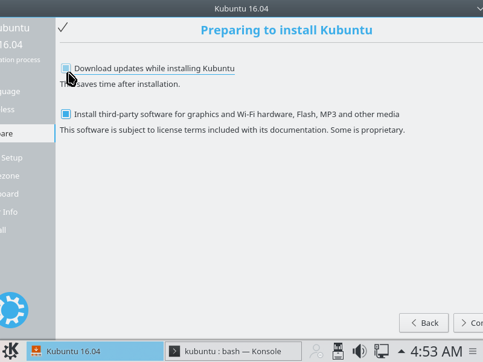

# ZPLAB Production Linux System Installation and Configuration

"ZPLAB production Linux system" refers to any computer in the lab that controls hardware for running scientific experiments and/or is
available to lab users on a shared basis for experiment data storage and analysis. These systems run the latest Kubuntu LTS release and
should be installed and configured as specified in this document.

### Kubuntu vs Ubuntu

Kubuntu is an officially supported variant of Ubuntu, differing only in that KDE rather than Unity is installed by default. The difference
is relatively unimportant, and these instructions should apply just as well to Ubuntu as to Kubuntu.

### A note on installing to a system with an existing RAID array

If the array or arrays were created following the instructions in the [array protocols and procedures document](./array_protocols_and_procedures.md),
no additional steps are required in order to protect the array from damage during Linux installation or reinstallation. The disk to be
used as root should be readily identifiable in the output of the `lsblk` command. If care is taken to partition and format only this
disk, the installation process will have no impact on the array. A configuration step is required to make the array properly visible
to users of the newly installed system; this step is detailed in the _Configuring a pre-existing array_ subsection of the _Configuration_
section.

## Installation

### Find or make a bootable Kubuntu USB flash memory stick

If there is not already a USB flash memory stick available with the latest Kubuntu LTS release,
[download the 64-bit release](http://www.kubuntu.org/getkubuntu/). Once the download completes, follow the instructions for creating a
bootable USB stick on the operating system where you downloaded Kubuntu:
[OS X / macOS](http://www.ubuntu.com/download/desktop/create-a-usb-stick-on-mac-osx),
[Linux](http://askubuntu.com/questions/372607/how-to-create-a-bootable-ubuntu-usb-flash-drive-from-terminal),
[Windows](http://www.ubuntu.com/download/desktop/create-a-usb-stick-on-windows).

### Boot the Kubuntu USB flash memory stick

On a non-Apple computer, just having the USB stick connected when the system is powered-on or rebooted
often works, but it may be necessary to modify BIOS settings in order to place "USB thumb drives" or "USB hard disks" first in the boot order. On an
Apple computer, it may be necessary to hold down the "C" key as the system is powered-on or rebooted in order to be presented with a menu allowing
boot device selection.

### Open a terminal window

Once the system boots into a graphical interface and settles down, click the launcher button in the lower left corner of the screen,
type "konsole", and press enter.


### Identify the drive that will contain the root filesystem

In the terminal window, run ```lsblk -o name,size,fstype,mountpoint,model,serial```. On a production system with a RAID array, you will see
something like this (drive serial numbers replaced with █ characters):

```
> lsblk -o name,size,fstype,mountpoint,model,serial
NAME     SIZE FSTYPE     MOUNTPOINT MODEL            SERIAL
sda    232.9G                       Samsung SSD 840  S██████████████
├─sda1 192.9G zfs_member
├─sda2    32G
└─sda3     8G swap
sdb      3.7T                       WDC WD40EZRX-00S WD-████████████
└─sdb1   3.7T
sdc      3.7T                       WDC WD40EZRX-00S WD-████████████
└─sdc1   3.7T
sdd      3.7T                       WDC WD40EZRX-00S WD-████████████
└─sdd1   3.7T
sde      3.7T                       WDC WD40EZRX-00S WD-████████████
└─sde1   3.7T
sdf      3.7T                       WDC WD40EZRX-00S WD-████████████
└─sdf1   3.7T
sdg      3.7T                       WDC WD4000FDYZ-2 WD-████████████
└─sdg1   3.7T
sdh      3.7T                       WDC WD4000FDYZ-2 WD-████████████
└─sdh1   3.7T
sdi      3.7T                       WDC WD40EZRX-00S WD-████████████
└─sdi1   3.7T
sdj      3.7T                       WDC WD40EZRX-00S WD-████████████
└─sdj1   3.7T
sdk      3.7T                       WDC WD40EZRX-00S WD-████████████
└─sdk1   3.7T
sdl      3.7T                       WDC WD40EZRX-00S WD-████████████
└─sdl1   3.7T
sdo      3.7T                       WDC WD40EZRX-00S WD-████████████
└─sdo1   3.7T
sr0     1.4G iso9660           /cdrom     CD-ROM
loop0   1.4G squashfs          /rofs
```

In the above example output, we see that _sda_ is the only SSD. This is pretty unambiguous - if the system has only one SSD, then that SSD is
typically going to contain the root filesystem and bootloader.

If you are not installing to an Apple computer, note the model name of the disk ("Samsung SSD 840" in the example output). This is needed for the
next step.

### Ensure that the root drive has the highest BIOS boot drive priority

_Skip this step if you are installing to an Apple computer_

Although plugging the root drive into motherboard SATA controller port 0 helps to avoid this problem, it may still happen that a RAID
disk is selected as the most preferred boot drive. If, during installation, some drive other than the root is first in the BIOS boot
order, the system becomes dependant on that drive's presence in order to boot. The configuration script you are instructed to run
later in this document will detect this misconfiguration and output a warning if it is present.

TODO: phoenix bios drive order screenshot

### Verify that a network connection is available

A network connection is required for the next step and for following steps. At ZPLAB, getting a
network connection typically only requires plugging in a network cable connected to a working bench or wall port. Not all bench and wall ports work.
In particular, open ports in obscure locations tend not to be "provisioned", a state that can mean many different things, but one that is always
resolved by sending and email to Kyle.

Connectivity can be verified by running `ping www.google.com` in the terminal window opened in the previous step.

### Run the GUI installer

Minimize the Konsole window you opened previous and click the GUI installer icon on the desktop.


Click continue at the language selection screen, and then enable installation with updates and third-party software. Click continue again.



Select the drive you wish to use as root as the installation target and click install.


From here, the default installer options are fine. Even the correct timezone should be detected. When prompted, create a user with the name and
user name `zplab` and the standard password (ask a lab member or email Zach for this).

### If "Guided - use entire disk" fails...

The installer attempts to make a swap partition equal to the size of system main memory. If the machine onto which you are installing Kubuntu has
RAM capacity approaching or exceeding root drive size, "Guided - use entire disk" mode will fail, and you must use the installer GUI to specify
partition layout manually. In this case, make an ext4 volume with mount point / that is 8000MB smaller than the default value (the default is the
entire disk), and make a swap partition filling the remainder.


### Reboot when prompted

After the installer completes, click reboot when prompted, and then remove the USB flash memory stick when prompted. The system should boot into the
new Kubuntu installation. If it does not and you have followed the instructions in the _Ensure that the root drive has the highest BIOS boot drive
priority_ section, something more subtle and potentially very arcane is at play, and it's advisable to call IT unless you have time for an excursion
into the nitty-gritty of grub, EFI, MBRs, etc.

## Configuration

Reconnect the USB flash memory stick and reboot. Ensure that the system boots from the memory stick, as described in the _Boot the Kubuntu USB flash
memory stick_ section. Next, open a terminal window and run
```wget https://raw.githubusercontent.com/erikhvatum/zplab-IT/master/production_linux/configure_kubuntu.py``` ([direct link](./configure_kubuntu.py))
followed by ```python3 configure_kubuntu.py```:

```
> wget https://raw.githubusercontent.com/erikhvatum/zplab-IT/master/production_linux/configure_kubuntu.py
--2016-10-02 00:27:45--  https://raw.githubusercontent.com/erikhvatum/zplab-IT/master/production_linux/configure_kubuntu.py
Resolving raw.githubusercontent.com (raw.githubusercontent.com)... 151.101.44.133
Connecting to raw.githubusercontent.com (raw.githubusercontent.com)|151.101.44.133|:443... connected.
HTTP request sent, awaiting response... 200 OK
Length: 45 [text/plain]
Saving to: ‘configure_kubuntu.py’

configure_kubuntu.py 100%[===================================================================>] 450 --.-KB/s in 0s

2016-10-02 00:27:45 (4.60 MB/s) - ‘configure_kubuntu.py’ saved [450/450]
> python3 configure_kubuntu.py
```

At this point, you will be prompted to select ZFS or ext4 as your root filesystem format.

### ZFS?

Configuring the installation to use a ZFS root is recommended for multi-user production Linux systems. ZFS provides good options for rapidly
escaping bad situations, and it has saved our bacon a number of times. However, a special-purpose system that is fast to configure and rarely
changed wouldn't necessarily benefit from ZFS, and any system with less than 16GiB of RAM is unlikely to receive any benefit unless a specific need
exists.

* Example of a system that **should have a ZFS root**: a custom-built computer controlling a Leica microscope situated in an incubator, hosting
a number of experiments belonging to any number of lab members.

* Example of a system that **may optionally have a ZFS root**: a fully-upgraded Mac Mini that has 16GiB of RAM, run Kubuntu, is connected to 6
scanners, and is primarily used by one lab member. OS X / macos would be a good choice for this role, except that SANE tends to be better behaved
on Linux and large numbers of USB devices are known to be problematic on certain OS X / macos releases.

* Example of a system that **should not have a ZFS root without a specific reason**: a Mac Mini running Linux, used by a single user for analyzing
data, examining images, reading and composing papers, email, presentations, and for other day-to-day tasks. Feel free to use whatever operating
system and configuration is most efficient for you on your assigned desktop system. This may be OS X / macos, Kubuntu, Windows, or some other Linux
flavor. However, any time spent using a ZFS root will probably be wasted unless you know you need it for some specific reason, such as manipulating
snapshots of million-file source trees as you track down a bug in Chromium (snapshot copy-on-write is a big time saver in this scenario - but this
scenario is uncommon at ZPLAB).

##